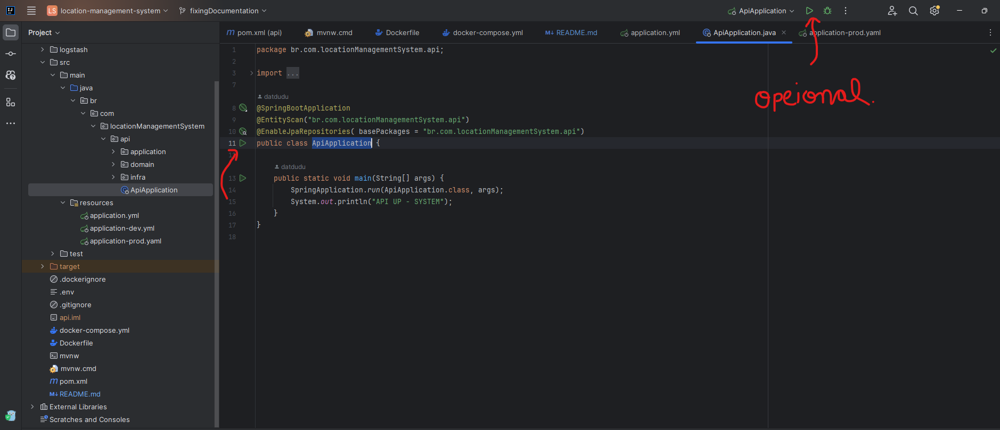

# Location API Java Project

Este é um projeto Java criado para representar uma API de Locais, utilizando o Spring Framework, JPA, H2 e Lombok. O objetivo deste projeto é fornecer uma aplicação simples para gerenciar Locais.
Projeto feito no período de 5 dias , então muitas funcionalidades estão cruas e não há muitas validações.

## Requisitos

Neste projeto há 3 formas de executar a aplicação e nelas a diferenças nos requisitos, que são:


### MODO DEV
- Java Development Kit (JDK) versão 21 ou superior
- Maven
- git (Opcional)
- 
### MODO PROD
- Java Development Kit (JDK) versão 21 ou superior
- Maven
- Banco PostgreSQL
- git (Opcional)
- 
### MODO DOCKER
- Docker e docker compose
- git (Opcional)
- 
## Como Executar:

1. Clone o repositório em sua máquina local:

```shell
git clone git@github.com:datdudu/location-management-system.git
```


Ou baixe o projeto como um arquivo zip e descompacte-o.

2. Navegue até o diretório do projeto:

```shell
cd ../location-management-system
```

### Modos de execução

#### DEV e PROD

- Compile o projeto usando o Maven:

```shell
mvn clean install
```
- Depois vá no arquivo application.yml (..\location-management-system\src\main\resources\application.yml) e escolha o perfil que você quer utilizar (dev ou prod), a diferença é que no perfil dev será utilizado um banco em memória H2 e no prod o banco relacional PostgreSQL

- Vá até src/java/com.datdudu.locationManagementSystem e execute a classe ApiApplication


#### DOCKER

- execute o comando:

```shell
docker-compose up --build
```


#### Testes
- Para executar os testes unitários da aplicação, utilize o comando:
```shell
mvn test
```

#### Documentação 
- A aplicação com a documentação no swagger estará disponível em `http://localhost:8080/swagger-ui/index.html`.
- Documentação feita no swagger
- Para acessar a documentação em Markdown e os Endpoints [clique aqui](https://github.com/datdudu/local-management-java/blob/main/Documentation.md).


#### Requisições
- Para fazer requisições use `http://localhost:8080/api/v1/{resource}`


## Funcionalidades

- Adicionar um novo Local
- Visualizar todos os Locais
- Atualizar um Local
- Remover um Local

## Tecnologias Utilizadas

- Spring Framework: para a configuração da aplicação e injeção de dependências. (Versão 3.2.3)
- JPA (Java Persistence API): para mapeamento objeto-relacional (ORM) e persistência de dados.
- H2 Database: banco de dados em memória para desenvolvimento e testes mais rapidamente
- Lombok: para reduzir a verbosidade do código Java.
- Docker: Alternativa de execução, eliminando a necessidade de instalar todas as ferramentas, podendo alterar, executar e acessar os recursos em um ambiente estável

## Conhecimentos Aplicados
- Conteinerização: Utilizar docker e colocar a aplicação e banco e conteiners configurados, facilitando o desenvolvimento da aplicação, tirando a necessidade de instalar todas as ferramentas necessaárias na máquina
- Clean Archtecture: Implementação básica da Clean Archtecture separando a responsabilidade de API em 3 camadas, com comunicação unidirecional, diminuindo a interdependencia entre os arquivos
- API: Aplicação dos retornos corretos para cada um dos métodos HTTP utilizados
